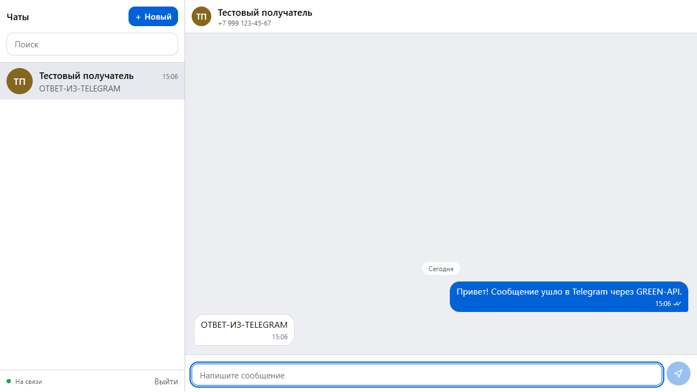
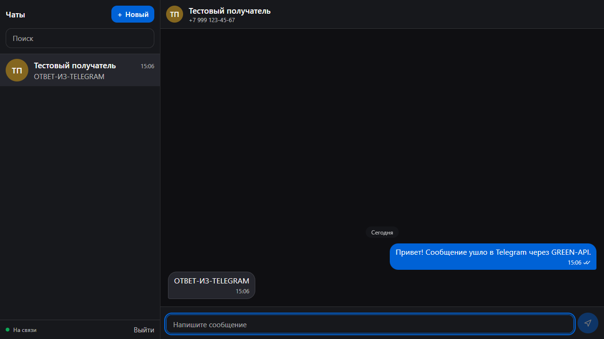
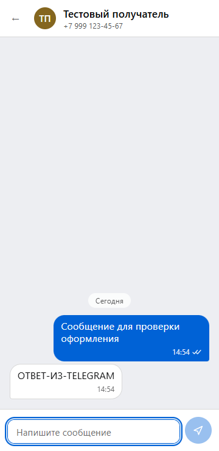
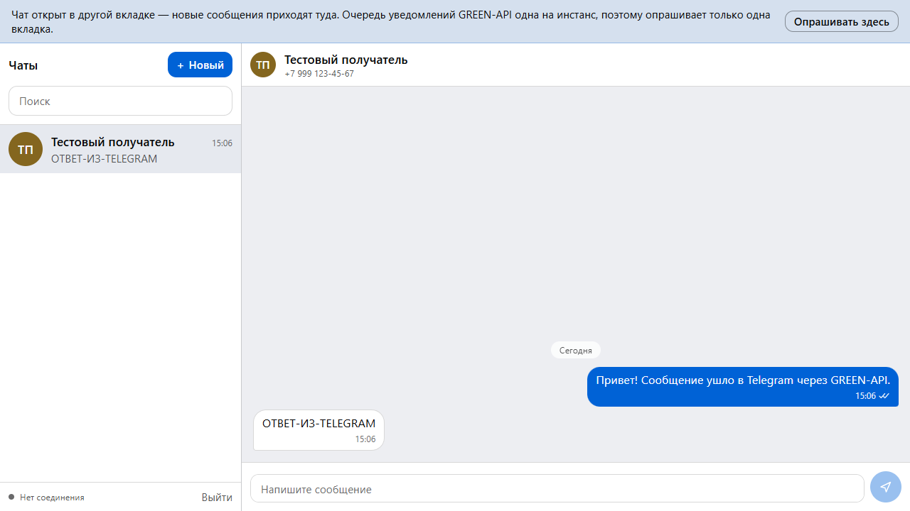

# Веб-чат на GREEN-API

Интерфейс для отправки и получения текстовых сообщений в Telegram через [GREEN-API](https://green-api.com).
Внешний вид сделан по прототипу [web.max.ru](https://web.max.ru).

## Как проверить проект

Полный путь от нуля до «получил ответ в чате» — примерно 10 минут.

### Что понадобится

| | |
| --- | --- |
| Node.js | версия **20.19+** или **22.12+** (требование Vite 7). Проверить: `node -v` |
| Аккаунт GREEN-API | бесплатный тариф Developer подходит |
| Аккаунт Telegram | отправитель — его привяжете к инстансу. **Заведите отдельный аккаунт**, см. предупреждение ниже |
| Второй Telegram | получатель, чтобы ответить на сообщение. Здесь подойдёт ваш основной аккаунт |

> Нужны именно **два разных** аккаунта Telegram: один отправляет из веб-чата, второй отвечает
> из мессенджера. Отправить сообщение самому себе не получится.

> [!WARNING]
> **Привязывайте к инстансу отдельный аккаунт, а не основной.**
>
> GREEN-API работает с Telegram не через Bot API, а как обычный клиент: при авторизации
> на серверах сервиса создаётся полноценная сессия вашего аккаунта. В Telegram она видна
> в разделе «Устройства», а при включённой двухфакторной защите сервису придётся передать
> и облачный пароль.
>
> Такая сессия имеет доступ ко всем облачным чатам, группам и контактам аккаунта и может
> отправлять сообщения от вашего имени — не только в тот чат, который вы создадите здесь.
> Секретных чатов это не касается: они привязаны к устройству.
>
> Это свойство самой модели доступа, общее для всех сервисов такого класса. Но риск снимается
> просто: заведите Telegram на запасной или виртуальный номер и привязывайте его. Отвечать
> при проверке можно с основного аккаунта — получатель ни к чему не привязывается.
>
> **После проверки завершите доступ:** Telegram → Настройки → Устройства → завершить сеанс
> GREEN-API, и разлогиньте инстанс в личном кабинете.

### Шаг 1. Получить учётные данные GREEN-API

1. Зарегистрируйтесь на <https://green-api.com> и войдите в личный кабинет
   (<https://console.green-api.com>).
2. Создайте инстанс с поддержкой **Telegram**.
3. Авторизуйте инстанс — привяжите аккаунт Telegram отправителя (сканирование QR-кода или
   вход по номеру телефона, как предложит кабинет). Используйте **отдельный аккаунт**,
   а не основной — почему, написано в предупреждении выше.
4. Дождитесь, пока состояние инстанса станет **`authorized`**. Пока оно другое, приложение
   не пустит дальше экрана входа — и это правильно: отправка всё равно не сработала бы.
5. Скопируйте из карточки инстанса два значения:
   - **`idInstance`** — число, например `1101000001`;
   - **`apiTokenInstance`** — длинная строка, например `d75b3a66c9e14d0e9c69b6…`.

Больше в кабинете ничего настраивать не нужно: вебхуки приложение выставит само при первом входе.

### Шаг 2. Запустить проект

```bash
git clone <URL репозитория>
cd GreenApiTest
npm install
npm run dev
```

Откройте <http://localhost:5173>. Никаких `.env`-файлов создавать не нужно.

### Шаг 3. Войти

Введите на экране входа `idInstance` и `apiTokenInstance` из шага 1 и нажмите **«Войти»**.

Что происходит под капотом (видно по надписи на кнопке):

1. проверяется состояние инстанса — пускаем только при `authorized`;
2. проверяются настройки приёма уведомлений и, если они отличаются, выставляются нужные;
3. если настройки менялись, инстанс перезапускается — приложение ждёт его возврата
   в рабочее состояние. Это занимает несколько секунд, кнопка покажет «Инстанс перезапускается…».

После входа в левом нижнем углу должно появиться зелёное **«На связи»** — значит, опрос
входящих сообщений запущен.

### Шаг 4. Создать чат

Нажмите **«+ Новый»**, введите номер телефона получателя и нажмите **«Создать чат»**.

Это номер **второго** аккаунта — того, с которого вы будете отвечать. Номер аккаунта,
привязанного к инстансу, вводить не нужно: он и так определён как отправитель.

Номер можно вводить как угодно — `+7 999 123-45-67`, `8 999 123 45 67`, `79991234567`:
приложение нормализует его само и покажет под полем итоговый `chatId`.

> [!IMPORTANT]
> В Telegram нельзя написать произвольному номеру. Если у получателя в настройках приватности
> «Кто может найти меня по номеру телефона» выбрано «Мои контакты», незнакомый отправитель
> до него не достучится — сообщение уйдёт с ошибкой.
>
> Перед проверкой добавьте два аккаунта друг у друга в контакты либо временно выставьте
> у получателя эту настройку в «Все».

### Шаг 5. Отправить сообщение

Напишите текст в поле внизу и нажмите **Enter** (`Shift+Enter` — перенос строки).

Сообщение появится в переписке сразу, а иконка рядом со временем покажет его судьбу:
🕐 отправляется → ✓ принято GREEN-API → ✓✓ доставлено.

### Шаг 6. Ответить из Telegram

Возьмите телефон получателя, откройте Telegram — там будет ваше сообщение. Ответьте на него.

**Ответ появится в веб-чате за несколько секунд**, без перезагрузки страницы. Можно не
возвращаться к вкладке заранее: опрос работает и когда вкладка в фоне.

На этом сценарий из ТЗ пройден полностью.

### Что ещё стоит посмотреть

| Действие | Ожидаемое поведение |
| --- | --- |
| Перезагрузить страницу | Вход и вся переписка восстанавливаются |
| Отключить интернет на 10 секунд | Индикатор → «Переподключение…», после возврата сети — снова «На связи», без перезагрузки |
| Открыть приложение во второй вкладке | Вторая вкладка покажет баннер: опрашивает только одна. Кнопка «Опрашивать здесь» передаёт роль |
| Написать с телефона первым | Придёт входящее, чат создастся сам, в списке появится счётчик непрочитанных |
| Переключить тему ОС на тёмную | Интерфейс переключится следом |
| Сузить окно до ширины телефона | Панели переключаются на одну, появляется кнопка «назад» |
| Нажать «Выйти» | Токен и история чатов удаляются из браузера |

### Если что-то не работает

| Симптом | Причина и что делать |
| --- | --- |
| «Неверные idInstance или apiTokenInstance» | Опечатка в кредах либо токен отозван. Скопируйте заново из кабинета |
| «Инстанс не авторизован» | Привязка аккаунта не завершена. Доведите её в кабинете GREEN-API |
| «Инстанс в спящем режиме» | Откройте Telegram на телефоне, дайте инстансу проснуться и повторите вход |
| Сообщения уходят, ответы **не приходят** | В настройках инстанса задан `webhookUrl`. Тогда GREEN-API шлёт уведомления POST-запросом на этот адрес и **не кладёт их в очередь**, из которой читает приложение. Очистите поле в кабинете и войдите заново — приложение выставит настройки само |
| Сообщение помечено `!` | Наведите курсор на иконку: там текст ошибки. Частые причины — лимит тарифа, у получателя нет Telegram с этим номером, либо его приватность закрывает поиск по номеру (см. шаг 4) |
| Ответы приходят через раз | Открыто две вкладки приложения. Очередь уведомлений одна на инстанс — закройте лишнюю |
| `npm install` падает | Старый Node. Нужен 20.19+ или 22.12+ |

---

| Светлая тема | Тёмная тема |
| --- | --- |
|  |  |

| Мобильная раскладка | Работа в двух вкладках |
| --- | --- |
|  |  |

---

## Содержание

- [Как проверить проект](#как-проверить-проект)
- [Что умеет](#что-умеет)
- [Стек](#стек)
- [Быстрый старт](#быстрый-старт)
- [Переменные окружения](#переменные-окружения)
- [Скрипты](#скрипты)
- [Сборка и деплой](#сборка-и-деплой)
- [Архитектура](#архитектура)
- [Ограничения](#ограничения)
- [Соответствие ТЗ](#соответствие-тз)

---

## Что умеет

- вход по учётным данным инстанса GREEN-API (`idInstance`, `apiTokenInstance`);
- создание чата по номеру телефона получателя;
- отправка текстовых сообщений в Telegram;
- приём ответов в реальном времени через long polling HTTP API;
- статусы доставки (отправляется → отправлено → доставлено → прочитано) и повтор упавшей отправки;
- список чатов с превью последнего сообщения, непрочитанными и поиском;
- сохранение переписки между перезагрузками;
- светлая и тёмная темы, адаптив от 360 px, полная клавиатурная навигация.

По условиям задания поддерживаются **только текстовые** сообщения. Сообщения других типов
не исчезают из переписки — они показываются плейсхолдером с указанием типа.

---

## Стек

| | |
| --- | --- |
| Библиотека | React 19 |
| Сборка | Vite 7 |
| Стили | Tailwind CSS 4 |
| Язык | TypeScript 5.8 (strict) |
| Состояние | `useReducer` + Context |
| Линтинг | ESLint 9 (flat config) + Prettier |

Внешних зависимостей во время выполнения, кроме React, нет: HTTP-клиент, работа с состоянием
и опрос уведомлений написаны вручную.

---

## Быстрый старт

```bash
npm install
npm run dev     # http://localhost:5173
```

Подробный порядок проверки — в разделе [Как проверить проект](#как-проверить-проект).

---

## Переменные окружения

Все необязательные. Шаблон — в [`.env.example`](.env.example); для локальной разработки создайте
`.env.local` (он в `.gitignore`).

| Переменная | По умолчанию | Назначение |
| --- | --- | --- |
| `VITE_GREEN_API_URL` | `https://api.green-api.com` | Базовый URL API. Менять обычно не нужно. |
| `VITE_USE_PROXY` | `false` | `true` — запросы идут через dev-прокси Vite (`/green-api`) в обход CORS. |
| `VITE_DEV_ID_INSTANCE` | — | Предзаполнить форму входа при разработке. |
| `VITE_DEV_API_TOKEN_INSTANCE` | — | То же для токена. **В git не коммитить.** |

---

## Скрипты

| Команда | Что делает |
| --- | --- |
| `npm run dev` | Dev-сервер на <http://localhost:5173> |
| `npm run build` | Проверка типов и production-сборка в `dist/` |
| `npm run preview` | Локальный просмотр собранной версии |
| `npm run lint` | ESLint |
| `npm run typecheck` | Только проверка типов |
| `npm run format` | Prettier |

---

## Сборка и деплой

```bash
npm run build      # результат в dist/
npm run preview    # проверить сборку локально
```

`dist/` — статика, бэкенд не нужен: браузер обращается к GREEN-API напрямую.
API отдаёт `Access-Control-Allow-Origin: *`, поэтому приложение работает с любого домена
без прокси.

В `vite.config.ts` задан `base: './'` — пути к ассетам относительные, так что сборка одинаково
работает и в корне домена, и в подпапке.

### GitHub Pages

В репозитории уже лежит workflow [`.github/workflows/deploy.yml`](.github/workflows/deploy.yml):
сборка и публикация при каждом пуше в `main`.

Что нужно сделать один раз:

1. запушить репозиторий на GitHub;
2. открыть **Settings → Pages → Build and deployment** и выбрать **Source: GitHub Actions**;
3. дождаться выполнения workflow во вкладке **Actions**.

Приложение будет доступно по адресу `https://evdeveloper.github.io/Green-api-telegram/`.

> [!CAUTION]
> Не добавляйте `VITE_DEV_ID_INSTANCE` и `VITE_DEV_API_TOKEN_INSTANCE` в секреты репозитория
> или в workflow. Vite подставляет значения `VITE_*` прямо в собранный бандл — на GitHub Pages
> они окажутся в публичном JavaScript, доступном любому. Учётные данные вводятся только в форме
> входа и остаются в браузере пользователя.

SPA-fallback (`404.html`) не нужен: клиентского роутинга нет, приложение живёт на одном адресе.

### Другие хостинги

`dist/` можно положить на любой статический хостинг — Vercel, Netlify, nginx. Если хостинг
раздаёт приложение из корня домена, `base: './'` этому не мешает.

---

## Архитектура

```
src/
├── api/              Клиент GREEN-API: сборка URL, типы, классификация ошибок
│   ├── endpoints.ts    {apiUrl}/waInstance{id}/{method}/{token}, сокрытие токена в логах
│   ├── types.ts        Типы методов и уведомлений + предикаты сужения по typeWebhook
│   ├── errors.ts       GreenApiError с kind: unauthorized / rateLimited / quotaExceeded / ...
│   └── greenApi.ts     fetch с таймаутами и отменой, отдельный таймаут для long polling
├── features/
│   ├── auth/           Экран входа, настройка вебхуков инстанса
│   ├── chats/          Список, шапка, диалог нового чата, индикатор соединения
│   ├── messages/       Лента, бабблы, статусы, поле ввода, маппинг уведомлений
│   ├── polling/        Цикл приёма и выбор активной вкладки
│   └── layout/         Двухпанельная раскладка
├── store/              useReducer + Context, персист в localStorage
├── components/         Avatar, Toast, Banner
└── lib/                Номера телефонов, chatId, форматирование времени
```

---

## Ограничения

- **Токен хранится в `localStorage` в открытом виде.** Осознанное упрощение для тестового задания,
  чтобы не вводить креды при каждой перезагрузке. В продакшене токен не должен покидать бэкенд:
  браузер обращался бы к своему серверу, а тот — к GREEN-API. Кнопка «Выйти» удаляет и токен,
  и историю чатов.
- Поддерживаются только текстовые сообщения (требование ТЗ). Остальные типы показываются
  плейсхолдером.
- Групповые чаты не поддерживаются.
- Список чатов ведётся локально: чат появляется после создания вручную или после первого
  входящего сообщения от собеседника.
- Локально хранятся последние 200 сообщений на чат; более ранние подтягиваются через
  `getChatHistory` при открытии чата.

---

## Соответствие ТЗ

| Требование | Где реализовано |
| --- | --- |
| Интерфейс отправки и получения сообщений | `src/features/messages/` |
| Сервис GREEN-API | `src/api/greenApi.ts` |
| Только текстовые сообщения | `mapNotification.ts` — остальные типы отсекаются явно |
| Прототип — внешний вид web.max.ru | `src/index.css` — токены сняты с дизайн-системы MAX |
| Минимальный набор функций | Вход, список чатов, переписка, отправка — без лишнего |
| Отправка через `SendMessage` | `greenApi.ts` → `sendMessage` |
| Приём через HTTP API | `useNotificationPolling.ts` → `receiveNotification` + `deleteNotification` |
| React | React 19 |
